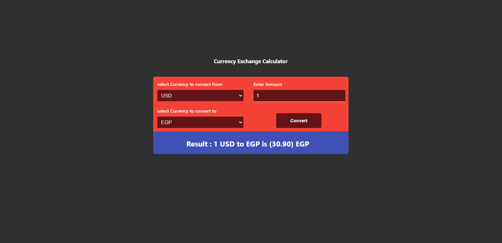

# Currency Converter

</img>

## Try it Live!

Check out the live app [Currency Calculator]()

## Tools Used

-   React
-   CSS
-   create-react-app

## Getting Started

1. Clone this repository.

    ```bash
    git clone https://github.com/mahmoud-mohsen-dev/currencyConverter.git
    ```

2. Navigate to the Project Directory:
    ```bash
    cd currencyConverter
    ```
3. Install Dependencies:

    ```bash
     npm install
    ```

4. Start the Development Server:

    ```bash
    npm run start
    ```

5. Open in your Browser:

    Open your web browser and go to http://localhost:3000 to see the app in action.

Now you have the "currencyConverter" app up and running on your local machine.
